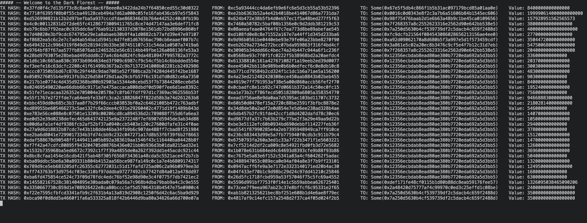

# memwatch

Watch the Ethereum mempool.

to compile: `make compile`  
to run: `make run`

Run it in full screen for better visualization.

Place your websocket node api in a `.env` file like in the `.env.example`.
